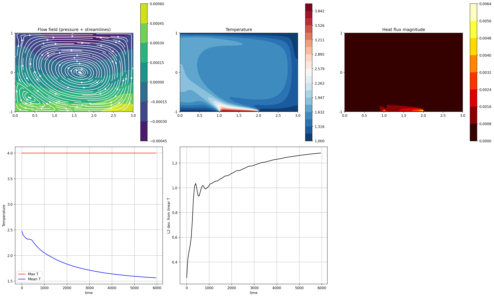

# Natural Convection with Localized Bottom Heating

A 2D finite-difference simulation of natural convection in a rectangular cavity with a localized heated patch on the bottom wall. The solver couples the incompressible Navier–Stokes equations with a temperature transport equation through the Boussinesq buoyancy approximation.



## Physics

The simulation models buoyancy-driven flow in a cavity of dimensions `Lx × Ly = 3 × 2`. The middle third of the bottom wall is held at a hot temperature `T_hot`, while the rest of the bottom wall and the entire top wall are held at `T_cold`. The side walls are adiabatic (zero heat flux). The top wall optionally moves with velocity `Uwall`, allowing the user to study pure natural convection or mixed convection cases.

The governing equations, in the Boussinesq approximation, are:

- **Continuity:** ∇·**u** = 0
- **Momentum:** ∂**u**/∂t + (**u**·∇)**u** = −∇p + ν∇²**u** + g·β·(T − T_ref)·**ĵ**
- **Energy:** ∂T/∂t + (**u**·∇)T = κ∇²T

The buoyancy coefficient `g·β` is derived from the user-specified Rayleigh number:

```
Ra = g·β·ΔT·Ly³ / (ν·κ)   ⟹   g·β = Ra·ν·κ / (ΔT·Ly³)
```

so changing `Ra` directly tunes the strength of the buoyant forcing.

## Numerical Method

The solver uses a **fractional-step (projection) method** on a **staggered MAC grid**, with the following per-step algorithm:

1. **Predictor.** Compute provisional velocities `u*`, `v*` using explicit time integration of convection (2nd-order central), diffusion (2nd-order central), and the Boussinesq buoyancy source on the v-momentum equation.
2. **Pressure Poisson.** Solve `∇²p = (1/Δt)·∇·u*` by Successive Over-Relaxation (SOR) until the relative residual is below `err_tol`.
3. **Corrector.** Project the velocities to be divergence-free: `u = u* − Δt·∇p`.
4. **Energy.** Advance temperature using a 1st-order upwind scheme for convection and 2nd-order central differences for diffusion.

Boundary conditions are enforced through ghost cells. The time step is CFL-limited by both convective and viscous constraints.

## Results

A representative run with `Ra = 10⁶`, `Pr = 0.71`, and `Uwall = 0.01` on a `121 × 81` grid produces:

- A dominant recirculation cell driven by the combined buoyancy and lid shear
- A thin thermal boundary layer above the heated patch
- Concentrated heat flux at the heated patch and along the cold top wall
- Bulk fluid temperature settling well below the conduction-only mean, indicating efficient convective transport

The L2 deviation from the linear (pure-conduction) reference profile climbs steeply during the transient and plateaus near a statistically steady state, confirming the simulation reaches an equilibrated convective regime.


The codebase is intentionally split so that `solver.py` can be imported and used independently of the notebook, e.g. for parameter sweeps or batch runs.

## Installation

Clone the repository and install the dependencies:

```bash
git clone https://github.com/Chowdhurypretomroy/Natural-Convection-FDM.git
cd Natural-Convection-FDM
pip install -r requirements.txt
```

## Usage

### Running the notebook

```bash
jupyter notebook notebooks/simulation.ipynb
```

Then `Cell → Run All`. The notebook visualizes the flow field, temperature, and heat flux every 100 steps and writes the time history to `results/simulation_results.npz` at the end.

### Running the solver directly from Python

```python
import sys
sys.path.insert(0, 'src')
import solver

p = solver.Params(Nx=121, Ny=81, Ra=1e6, endT=20.0)
state, params, grid, dt = solver.run(p)

print(f"Final mean T: {state.T.mean():.3f}")
```

For diagnostics during the run, pass a callback:

```python
def log(step, t, state):
    print(f"step={step}, t={t:.3f}, max|v|={abs(state.v).max():.3e}")

state, _, _, _ = solver.run(p, callback=log, callback_every=100)
```

## Parameters

All parameters are defined in the `Params` dataclass in `src/solver.py`. Key knobs:

| Parameter | Meaning | Default |
|-----------|---------|---------|
| `Nx`, `Ny` | Grid resolution | 121, 81 |
| `Ra` | Rayleigh number (buoyancy strength) | 1e6 |
| `Pr` | Prandtl number | 0.71 |
| `T_hot`, `T_cold` | Wall temperatures | 4.0, 1.0 |
| `Uwall` | Top-wall velocity (set 0 for pure natural convection) | 0.01 |
| `endT` | End time in advective units | 20.0 |
| `CFL`, `CFLv` | Convective and viscous CFL numbers | 0.2, 0.4 |
| `err_tol` | SOR pressure residual tolerance | 1e-5 |

## Known Limitations

- **Pure-Python loops.** The hot kernels (`calc_aux_u`, `calc_aux_v`, `solve_temperature`, `sor_sweep`) use nested Python loops. A full run at `121 × 81` with `endT = 20` takes roughly 3 hours on a typical laptop. Adding `@numba.njit` decorators would give a 50–100× speedup with minimal code change.
- **First-order upwind temperature.** The energy equation uses 1st-order upwind convection, which is robust but introduces numerical diffusion. A higher-order scheme (QUICK, MUSCL) would sharpen the thermal plume.
- **Stability limiter on temperature update.** `solve_temperature` clips the per-step temperature change and the absolute value to keep the scheme bounded. This is documented in the code and acts as a safety net when `Ra` is pushed high enough that the explicit upwind scheme alone would oscillate.
- **No formal validation against benchmarks.** The L2 deviation in the notebook is computed against the pure-conduction (linear) profile, not against an analytical or benchmark solution. Validation against the de Vahl Davis benchmark for differentially heated cavities would be a natural next step.

## Future Work

- Vectorize hot loops with `numba` or rewrite kernels in NumPy for substantial speedups
- Implement a higher-order convection scheme for temperature
- Replace SOR with a multigrid or FFT-based Poisson solver
- Validate against the de Vahl Davis benchmark
- Extend to 3D
- Adaptive time stepping based on the running CFL number

## License

This project is released under the MIT License. See `LICENSE` for details.


